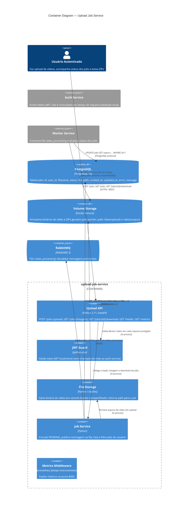

# C4 Container Diagram — Upload Job Service

**Nível**: Container (C4 Nível 2)  
**Serviço**: `upload-job-service`  
**Atualizado**: 2026-03-13

---

---

## Elementos

| Elemento | Tipo | Tecnologia | Responsabilidade |
|----------|------|-----------|-----------------|
| Upload API | Container | FastAPI | Endpoints REST de upload, listagem e download |
| JWT Guard | Container | python-jose | Validação local de JWT sem chamada ao auth-service |
| File Storage | Container | aiofiles | Persistência assíncrona de binários em volume Docker |
| Job Service | Container | Python | Lógica de negócio de jobs: criação, publicação, listagem |
| Metrics Middleware | Container | prometheus-fastapi-instrumentator | `/metrics` porta 8000 |
| PostgreSQL | ContainerDb | PostgreSQL 15 | Fonte de verdade para estado dos jobs |
| Volume Storage | ContainerDb | Docker Volume | Binários de vídeo e ZIPs (compartilhado com worker) |
| RabbitMQ | ContainerQueue | RabbitMQ 3 | Fila `video_processing` durable |

## Decisões de design

- Retorna `202 Accepted` imediatamente — processamento assíncrono via Worker Service (Princípio II da constituição)
- Isolamento de dados: `SELECT WHERE user_id = current_user.id` em todas as queries (Princípio III)
- Download só disponível para jobs `DONE` — Worker atualiza status diretamente no PostgreSQL compartilhado
