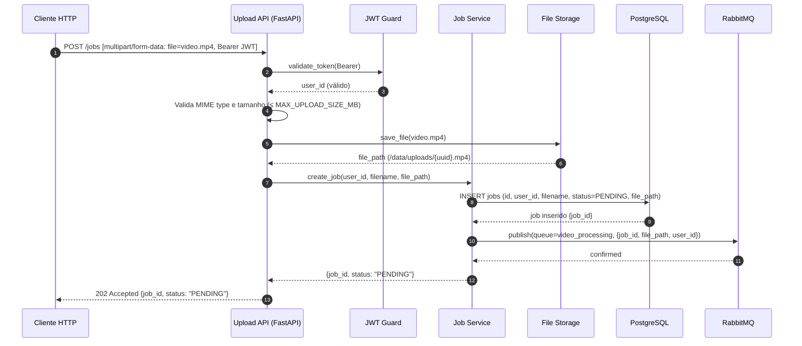
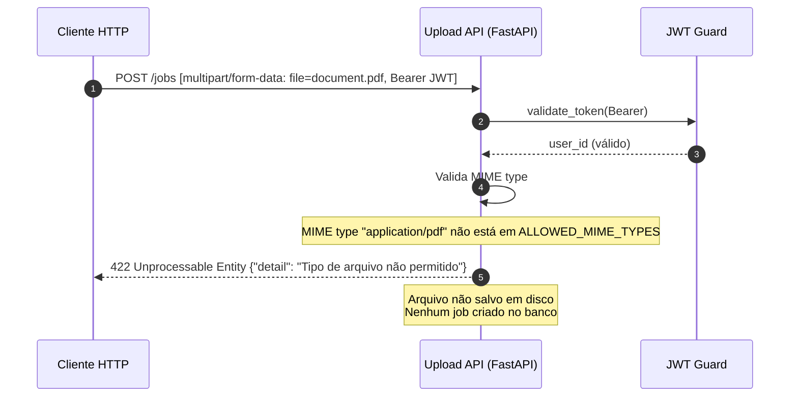
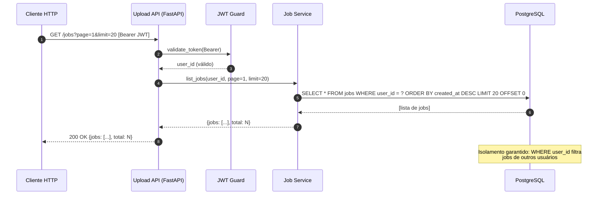

# Sequence Diagrams — Upload Job Service

**Serviço**: `upload-job-service`  
**Cobertura**: Happy path (US1 + US2) + erros críticos  
**Atualizado**: 2026-03-13

---

## Fluxo 1 — Happy Path: Upload de vídeo (US1)

---

## Fluxo 2 — Erro: Arquivo com formato inválido

---

## Fluxo 3 — Happy Path: Listagem de jobs do usuário (US2)

---

## Resumo dos fluxos

| Fluxo | Trigger | Resultado final |
|-------|---------|----------------|
| Upload bem-sucedido | POST /jobs com vídeo válido + JWT | 202 + job_id criado |
| Formato inválido | Arquivo não suportado (PDF, imagem, etc.) | 422 sem criação de job |
| Listagem | GET /jobs com JWT válido | 200 + jobs do usuário (isolados por user_id) |
